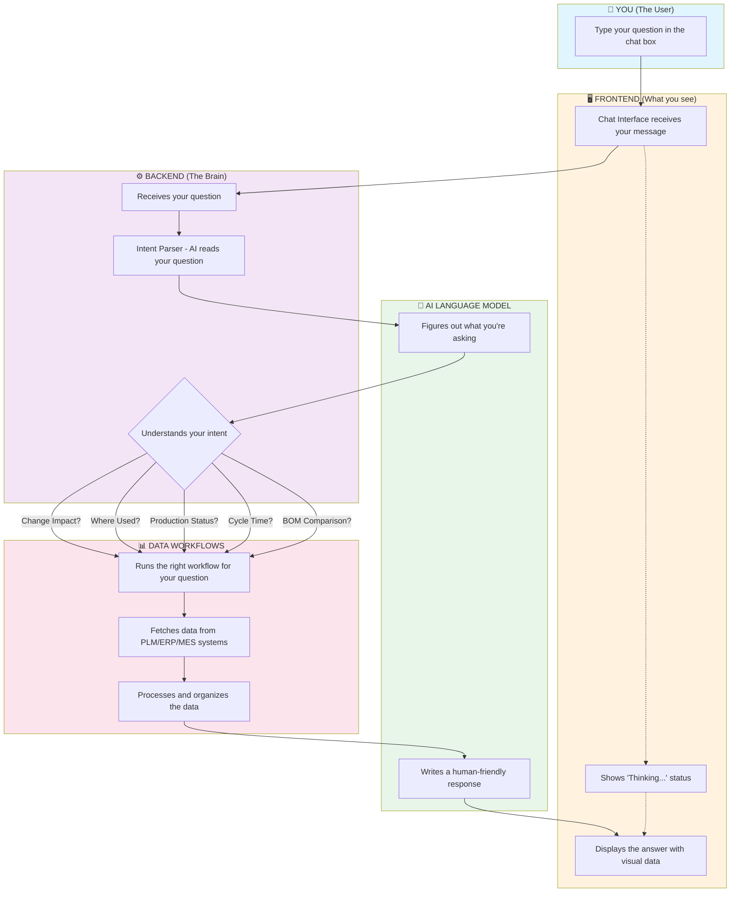
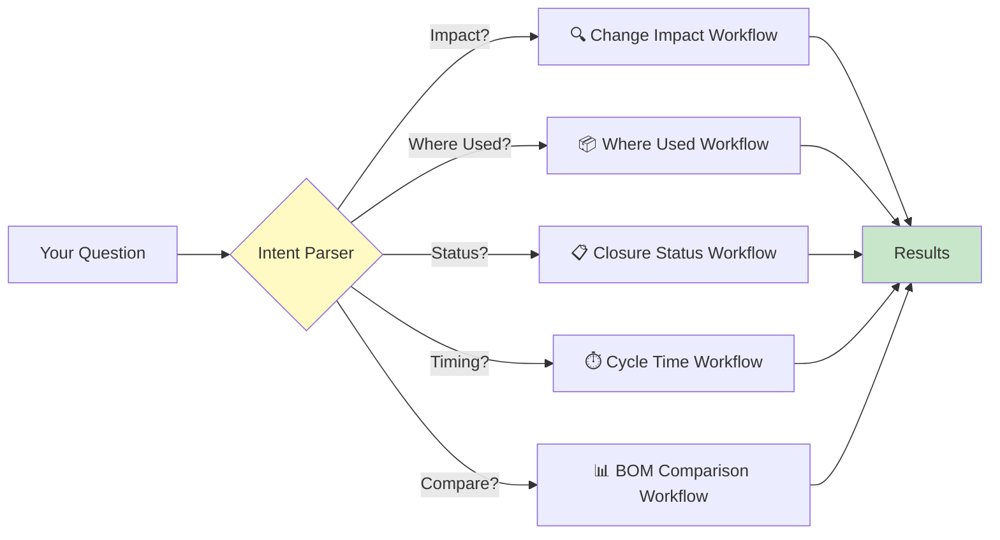
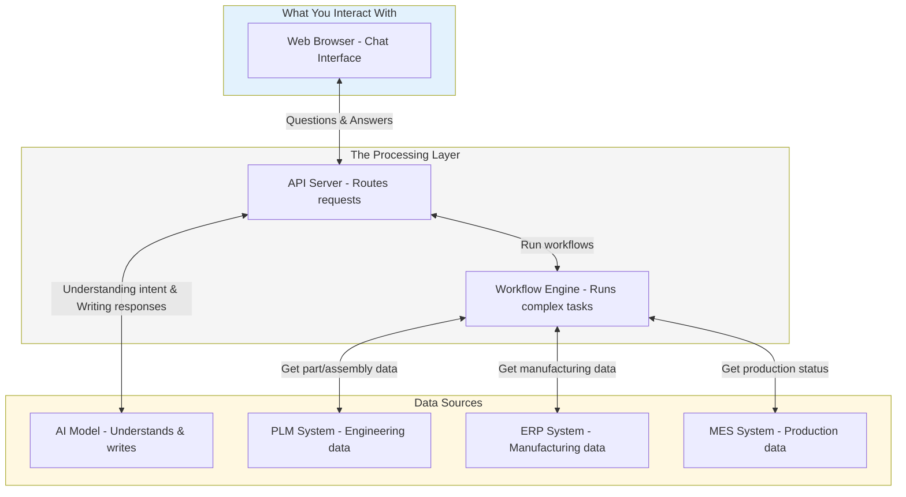
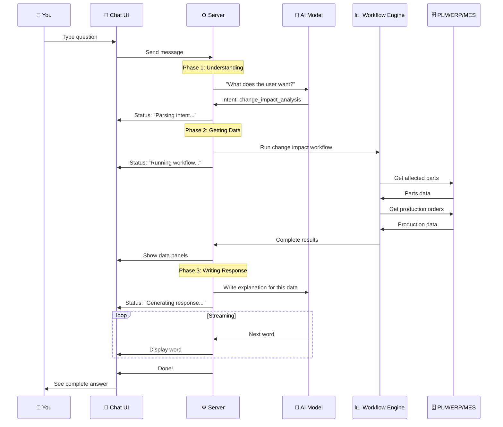

# iQbrain - How It Works

## What is iQbrain?

**iQbrain** is an intelligent assistant designed for manufacturing and engineering teams. It helps answer questions about product changes, parts usage, production status, and more - all through a simple chat interface, like chatting with a knowledgeable colleague.

---

## The Big Picture: How a Chat Becomes an Answer

When you type a question in iQbrain, here's what happens behind the scenes:

```
You ask a question → iQbrain understands what you want → 
It finds the data you need → It writes a helpful answer → 
You see the response
```

Think of it like asking a colleague a question:
1. They **listen** to your question
2. They **understand** what you're asking about
3. They **look up** the information in the right systems
4. They **explain** the answer to you in plain language

---

## Visual Flow: From Your Question to Your Answer

### The Complete Journey (Mermaid Diagram)



---

## Step-by-Step: What Happens When You Send a Message

### Step 1: You Type Your Question 💬

You type something like:
> "What parts will be affected if we change part ABC-123?"

The chat interface captures your message and sends it to the server.

---

### Step 2: The AI Understands Your Intent 🧠

The AI reads your question and figures out what you're really asking. It identifies:

| What You Asked | What iQbrain Understands |
|----------------|--------------------------|
| "What parts will be affected if we change..." | **Change Impact Analysis** - You want to see what will be impacted |
| "Where is this part used?" | **Where Used Analysis** - You want to find all assemblies using a part |
| "What's the status of production?" | **Closure Status Query** - You want production updates |
| "How long does this change take?" | **Cycle Time Analysis** - You want time metrics |
| "Compare the engineering BOM with manufacturing BOM" | **BOM Comparison** - You want to reconcile differences |

---

### Step 3: The Right Workflow Runs 🔄

Based on what you asked, iQbrain runs a specific workflow:



---

### Step 4: Data is Fetched from Your Systems 🗄️

The workflow connects to your enterprise systems:

| System | What It Provides |
|--------|------------------|
| **PLM** (Product Lifecycle Management) | Parts, assemblies, BOMs, engineering changes |
| **ERP** (Enterprise Resource Planning) | Manufacturing BOMs, inventory, production orders |
| **MES** (Manufacturing Execution System) | Real-time production status |

---

### Step 5: The AI Writes Your Answer ✍️

Once the data is gathered, the AI writes a clear, human-readable response. You see:
- A text explanation in plain language
- Visual panels showing the data (tables, hierarchies, metrics)
- Action items or recommendations when relevant

---

## The Technology Stack (Simplified)



---

## Project Folder Structure

Here's how the code is organized:

```
iQbrain-Deterministic-Agent-Stable/
│
├── 📁 client/                    ← THE CHAT INTERFACE (what you see)
│   ├── src/
│   │   ├── components/           ← Visual elements (chat bubbles, panels)
│   │   │   ├── App.tsx           ← Main application layout
│   │   │   ├── MessageList.tsx   ← List of chat messages
│   │   │   ├── MessageBubble.tsx ← Individual message display
│   │   │   └── WorkflowPanel.tsx ← Data visualization panels
│   │   └── hooks/
│   │       └── useChat.ts        ← Handles sending/receiving messages
│   └── Dockerfile                ← Container configuration
│
├── 📁 server/                    ← THE BRAIN (processes your questions)
│   ├── src/
│   │   ├── routes/
│   │   │   └── chat.ts           ← Handles chat requests
│   │   ├── lib/
│   │   │   └── openrouter.ts     ← Connects to AI for understanding
│   │   ├── temporal/
│   │   │   ├── client.ts         ← Starts workflows
│   │   │   ├── worker.ts         ← Runs workflows
│   │   │   └── intentRouter.ts   ← Picks the right workflow
│   │   ├── workflows/            ← Business logic for each question type
│   │   └── adapters/             ← Connects to PLM/ERP/MES
│   └── Dockerfile
│
├── 📁 packages/
│   └── shared-types/             ← Data formats shared between parts
│
└── docker-compose.yml            ← Runs everything together
```

---

## Key Concepts Explained

### What is "Intent"?
Intent is what you **actually want** when you ask a question. iQbrain's AI figures this out automatically. For example:
- "Show me where part X is used" → Intent: **where_used_analysis**
- "What happens if we change part Y?" → Intent: **change_impact_analysis**

### What is a "Workflow"?
A workflow is a **series of steps** that runs to answer your question. Each workflow:
1. Knows which systems to query
2. Gathers the right data
3. Processes it into useful information

### What is "Streaming"?
Instead of waiting for the entire answer, iQbrain sends the response **word by word** as it's generated. This is why you see the text appear gradually - it feels more natural and responsive.

---

## The 5 Types of Questions iQbrain Can Answer

| Question Type | What It Does | Example Question |
|--------------|--------------|------------------|
| 🔍 **Change Impact** | Shows what parts, assemblies, and production will be affected by a change | "What's the impact of changing part ABC-123?" |
| 📦 **Where Used** | Finds all places a part is used in assemblies | "Where is bracket XYZ used?" |
| 📋 **Closure Status** | Shows production closure status and bottlenecks | "What's holding up the closure trackers?" |
| ⏱️ **Cycle Time** | Calculates how long changes take to complete | "How long did change CR-456 take?" |
| 📊 **BOM Comparison** | Compares engineering BOM vs manufacturing BOM | "Compare EBOM and MBOM for assembly A1" |

---

## How Data Flows (Technical Sequence)



---

## Real-Time Updates (Server-Sent Events)

iQbrain uses **Server-Sent Events (SSE)** to send updates to your browser in real-time. Here's what each event means:

| Event | What It Means | What You See |
|-------|---------------|--------------|
| `session` | Your session is ready | (Nothing visible) |
| `status` | Processing phase update | "Parsing intent...", "Running workflow...", etc. |
| `intent` | AI understood your question | Intent badge on message |
| `workflow` | Data has been gathered | Data panels appear |
| `token` | Part of the AI's response | Text appears word by word |
| `done` | Response is complete | Message is finalized |
| `error` | Something went wrong | Error message shown |

---

## Summary

**iQbrain turns complex questions into simple answers by:**

1. **Listening** - Receiving your natural language question
2. **Understanding** - Using AI to figure out what you need
3. **Fetching** - Running workflows that gather data from PLM/ERP/MES
4. **Explaining** - Using AI to write a clear, helpful response
5. **Showing** - Displaying both text and visual data panels

All of this happens in seconds, giving you the answers you need without having to navigate multiple systems or write complex queries.

---

## Quick Reference Card

| If You Want To... | Ask Something Like... |
|-------------------|----------------------|
| See change impact | "What's affected by changing [part]?" |
| Find where a part is used | "Where is [part] used?" |
| Check production status | "What's the closure status?" |
| Know how long a change took | "What was the cycle time for [change]?" |
| Compare BOMs | "Compare EBOM and MBOM for [assembly]" |

---

*This documentation was created to help team members understand how iQbrain works without needing technical expertise.*
